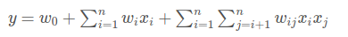
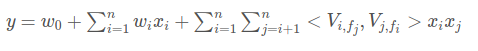

# Recommended-System-PyTorch

Recommended system(2018-2019)

## Data

(**Fin**)

1. movielen data
    - [ml-latest](http://files.grouplens.org/datasets/movielens/ml-latest.zip)
    - [ml-100k](http://files.grouplens.org/datasets/movielens/ml-100k.zip)
    - [ml-1m](http://files.grouplens.org/datasets/movielens/ml-1m.zip)
    - [ml-10m](http://files.grouplens.org/datasets/movielens/ml-10m.zip)
    - [ml-20m](http://files.grouplens.org/datasets/movielens/ml-20m.zi)
2. Criteo data

## Embedding

(**Fin**)

1. sparse features
2. sequence features
3. dense features

## CTR 模型

(**WIP**)

1. FM

    

2. FFM

    

3. DeepFM-201703

    

4. xDeepFM-2018

    

5. AFM-201708

    

6. NFM-201708

    

7. FGCNN-201904

    

8. MLR

    

9. NFFM

    

10. WDL

    

11. PNN-201611

    

12. CIN

    

13. CCPM-201510

    

14. AutoInt-201810

    

15. DCN-201708

    

16. DSIN

    

17. FNN-201601

    

18. DIEN

    

19. DIN-201706

    

## Refrences

1. 《推荐系统实践》
2. git@github.com:dawenl/vae_cf.git
3. git@github.com:eelxpeng/CollaborativeVAE.git
4. git@github.com:hidasib/GRU4Rec.git
5. git@github.com:hexiangnan/neural_collaborative_filtering.git
6. git@github.com:NVIDIA/DeepRecommender.git
7. [shenweichen/DeepCTR](https://github.com/shenweichen/DeepCTR)
